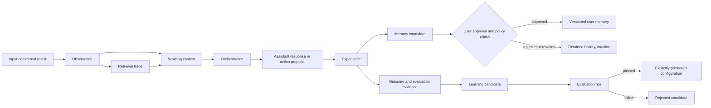

# JUNI neural-inspired schema proposal

**Status: design proposal, not yet a database migration.** This proposal translates durable engineering principles from the supplied *Neural Networks and Deep Learning* material and cross-checked research into JUNI’s product architecture. JUNI remains a human-brain-inspired personal AI system, not a biological simulation and not a claim of consciousness.

## Design thesis

The uploaded book emphasizes learning useful internal representations from observational data rather than encoding every solution as explicit rules. Its chapters move from layered architectures and learning signals to generalization, regularization, training difficulty, and deep representations [1]. For JUNI, the safe product analogue is not to expose or imitate hidden neural weights. It is to make the system’s observable pipeline explicit: an input becomes an observation, selected observations form working context, an orchestrator produces a response or action proposal, and verified outcomes can become evidence for later evaluation.

Continual-learning research describes the need to acquire, update, accumulate, and exploit knowledge over time while managing catastrophic forgetting and the stability–plasticity trade-off [2]. Memory-augmented-network research distinguishes memory mechanisms that supplement neural computation and discusses sensory, short-term, and long-term analogies alongside retrieval-oriented architectures [3]. Therefore, JUNI should not treat every message as a durable memory, should not silently overwrite user facts, and should not say that storing a record retrains a foundation model.

## Proposed conceptual layers

| Layer | Purpose | Persistence rule | Trust boundary |
| --- | --- | --- | --- |
| Observation | Immutable record of text, voice, image, document, video, webpage, or tool output received or produced | Persist metadata and provenance; store large bytes externally | External content is untrusted data |
| Working context | Short-lived selected material assembled for one response or task | Session-scoped and expirable | Includes explicit source and sensitivity labels |
| Episodic experience | Record of a conversation turn, tool call, action proposal, and observed outcome | Persist only when needed for audit, replay, or user history | Does not become a user fact automatically |
| Semantic knowledge | Normalized claims or chunks derived from approved sources | Versioned with source, extraction method, and confidence | Claim provenance and freshness are mandatory |
| User memory | User-approved stable preferences or facts | Explicit consent, revocation, versioning, and conflict history | User-owned and editable |
| Learning candidate | Proposed adaptation, routing hint, or policy improvement | Never active until evaluated and approved | Candidate is not a learned model update |
| Evaluation evidence | Test result, human feedback, or outcome measurement | Append-only evidence with evaluator and scope | Used to gate promotion and detect regressions |
| Retrieval trace | Record of what was retrieved, ranked, cited, and included in context | Persist for auditable responses where permitted | Retrieval output remains untrusted until checked |

## Proposed entities

The existing `users`, `conversations`, `messages`, and `storedFiles` tables remain the product foundation. The next schema increment should add the following entities, preferably in separate migrations with user ownership and indexes from the beginning.

| Entity | Key fields | Relationship and reason |
| --- | --- | --- |
| `observations` | `id`, `userId`, `conversationId`, `modality`, `contentRef`, `contentHash`, `sourceType`, `sourceUri`, `trustLevel`, `createdAt` | Normalizes multimodal inputs and external outputs without copying large media into the database |
| `contextItems` | `id`, `sessionId`, `observationId`, `memoryId`, `retrievalTraceId`, `selectionReason`, `expiresAt` | Makes attention/context selection inspectable and short-lived |
| `experiences` | `id`, `userId`, `conversationId`, `actionType`, `inputMessageId`, `outcomeStatus`, `outcomeSummary`, `createdAt` | Connects perception, orchestration, action, and result for episodic audit |
| `knowledgeClaims` | `id`, `userId`, `claimText`, `sourceObservationId`, `confidence`, `validFrom`, `validTo`, `revisionOf`, `status` | Stores versioned semantic claims rather than untracked summaries |
| `memories` | `id`, `userId`, `memoryType`, `valueJson`, `consentStatus`, `sensitivity`, `provenanceObservationId`, `version`, `revokedAt` | Holds explicit user-approved durable memory with edit/delete/revoke support |
| `memoryCandidates` | `id`, `userId`, `candidateType`, `candidateJson`, `reason`, `sourceExperienceId`, `status`, `reviewedAt` | Separates inferred or suggested memory from accepted memory |
| `retrievalTraces` | `id`, `userId`, `queryText`, `sourceType`, `sourceIdsJson`, `rankingJson`, `freshnessCheckedAt`, `includedInMessageId` | Records retrieval and citation lineage without treating retrieved text as instruction |
| `learningCandidates` | `id`, `scope`, `changeType`, `proposalJson`, `status`, `createdAt` | Represents a possible routing, prompt, or policy improvement without pretending model retraining occurred |
| `evaluationRuns` | `id`, `learningCandidateId`, `datasetRef`, `metricsJson`, `regressionSummary`, `decision`, `createdAt` | Applies validation and regularization-inspired discipline before promotion |

All tables that contain user data should carry `userId` and be accessed through protected procedures that derive ownership from server context. Foreign keys can be introduced in a later controlled migration after confirming the scaffold’s deployment database behavior; ownership filters are mandatory immediately.

## Lifecycle and state transitions

The pipeline must preserve distinct channels for system guidance, user input, retrieved content, tool output, and memory. Retrieved content and external pages remain untrusted data. A retrieval trace can support citations and later debugging, but it cannot alter system permissions or confirmation policy.

## Research-backed safeguards

**Generalization and overfitting.** The book’s treatment of cross-entropy, regularization, and overfitting implies a product-level need to avoid promoting an adaptation because it helped one interaction. JUNI should require scoped evaluation evidence, hold-out or replay tests where appropriate, and an explicit promotion decision. A user preference should not be generalized to all users, and an inferred fact should not be promoted to durable memory without consent.

**Stability and plasticity.** Continual-learning research makes the stability–plasticity trade-off explicit [2]. JUNI should preserve memory and knowledge revisions, allow rollback or revocation, and record conflicts instead of silently rewriting prior values. A candidate adaptation should remain inactive until its scope, owner, evidence, and expiration are known.

**External memory is not retraining.** Memory-augmented-network research motivates separate memory mechanisms and retrieval paths [3]. JUNI can improve future responses by retrieving approved records, but this is not equivalent to updating provider model parameters. UI and API copy must say “retrieved from approved memory” or “used as context,” not “JUNI learned permanently,” unless a real, evaluated model-update process exists.

**Multimodal normalization.** The book’s progression from visual recognition to deeper representations supports a layered observation model, but it does not justify assuming that text, audio, image, and video share identical semantics. Modality-specific metadata, processing status, hashes, provenance, and uncertainty should be retained before a normalized representation is used in context.

## Recommended implementation sequence

1. Add `observations`, `experiences`, and `retrievalTraces` first because they establish provenance and auditability around existing messages and future multimodal inputs.
2. Add `memories` and `memoryCandidates` with explicit consent, revocation, conflict history, and user-facing controls. Do not auto-promote inferred facts.
3. Add `knowledgeClaims` with source versioning and freshness fields before enabling research or document-derived knowledge.
4. Add `learningCandidates` and `evaluationRuns` only after a concrete evaluation dataset and promotion policy exist; until then, label adaptations as proposals.
5. Add typed protected procedures and tests for ownership, consent, conflict resolution, provenance retention, and rejection of untrusted context as instructions.

## Current decision

The proposal should remain documentation-only in this milestone. The existing JUNI schema is sufficient for authenticated conversations, messages, stored-file metadata, and server-mediated responses. The next code milestone should implement the first provenance slice—`observations`, `experiences`, and `retrievalTraces`—after the product confirms retention, privacy, and deletion requirements.

## References

[1]: http://neuralnetworksanddeeplearning.com/ "Michael Nielsen, Neural Networks and Deep Learning"
[2]: https://arxiv.org/abs/2302.00487 "Wang et al., A Comprehensive Survey of Continual Learning: Theory, Method and Application"
[3]: https://arxiv.org/abs/2312.06141 "Khosla, Zhu, and He, Survey on Memory-Augmented Neural Networks: Cognitive Insights to AI Applications"
